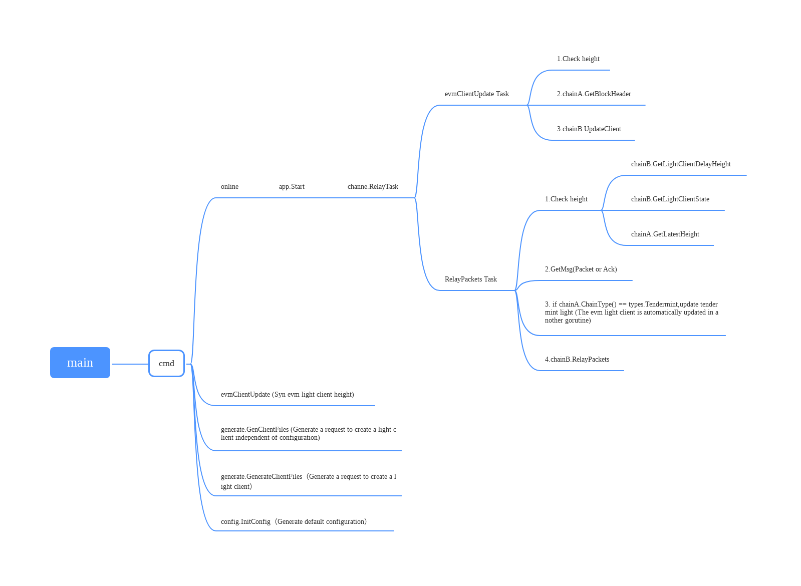
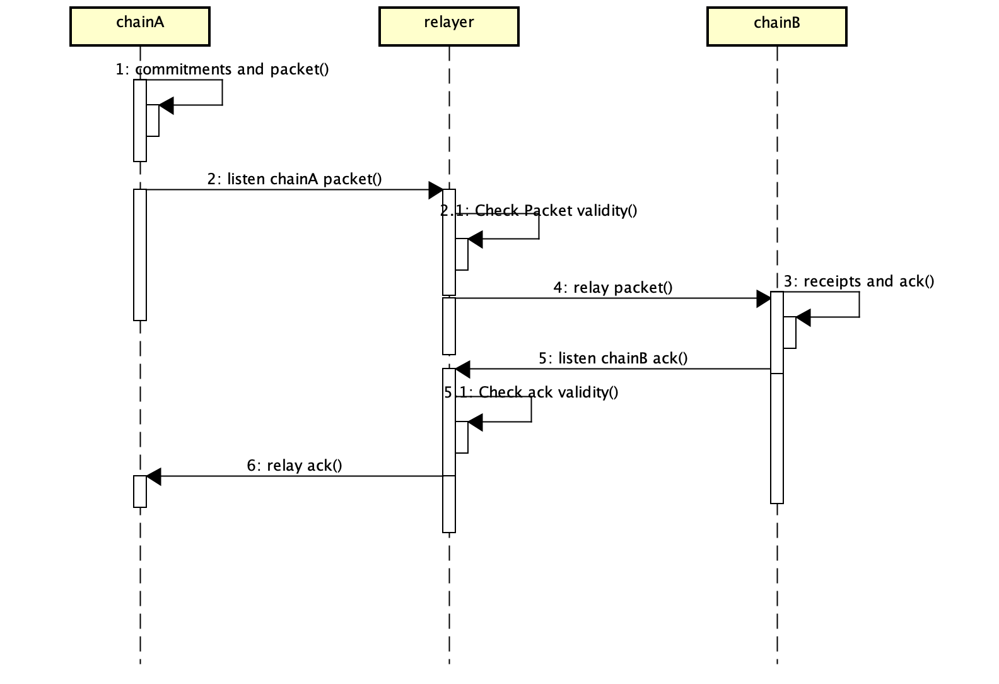

# teleport-relayer

## Synopsis outline

The Relayer algorithm is XIBC's "physical" connection layer -- the off-chain process is responsible for building appropriate datagrams by scanning the state of each chain and executing them on the opposite chain that the protocol allows. Data is relayed between two chains running the XIBC protocol.

## Motivation

In THE XIBC protocol, the blockchain can only record the intent to send specific data to another chain, not directly access the network transport layer. Physical datagram relay must be performed by an off-chain infrastructure that has access to the transport layer, such as TCP/IP. This standard defines the concept of the Relayer algorithm, which can be executed by an out-of-chain process with the ability to query the chain state in order to perform this relay.

## Definitions

Relayer is an off-chain process with the ability to read transaction status and submit transactions to some ledger set using the XIBC protocol.

Relayer is a program used to forward packets between two chains. ChainA and chainB are two different chains. The Relayer updates the Block Header of chainA to chainB in real time. The Relayer is also responsible for forwarding the Packet or Ack generated by chainA to chainB.When the packet and related credentials are forwarded to chainB, chainB can authenticate the packet based on the locally maintained Block Header and other related information of chainA.If the authentication is successful, a relay is completed.

## Introduction to code Structure

### Primary logical invocation relationships



### For each new SDK client, the following interfaces must be completed

```go
type IChain interface {
  // Get the Packet of the specified range
	GetPackets(fromBlock, toBlock uint64, destChainType string) (*types.Packets, error) 
  // Get Proof to prove Packet's validity
	GetProof(sourChainName, destChainName string, sequence uint64, height uint64, typ string) ([]byte, error)
	// Relay Packets
  RelayPackets(msg sdk.Msg) (string, error)
	GetPacketsByHash(hash string) (*types.Packets, error)
	GetCommitmentsPacket(sourChainName, destChainName string, sequence uint64) error
  // Determine whether the target chain has received the Packet
	GetReceiptPacket(sourChainName, destChainName string, sequence uint64) (bool, error)
	GetBlockHeader(*types.GetBlockHeaderReq) (exported.Header, error)
	GetLightClientState(string) (exported.ClientState, error)
	GetLatestHeight() (uint64, error)
	GetLightClientDelayHeight(string) (uint64, error)
	UpdateClient(header exported.Header, chainName string) error
	BatchUpdateClient(headers []exported.Header, chainName string) error
	GetResult(hash string) (uint64, error)
	ChainName() string
	ChainType() string
}
```

### The business layer needs to implement the following interfaces

```go
type IChannel interface {
	RelayTask(s *gocron.Scheduler)
	EvmClientUpdate(s *gocron.Scheduler)
  ManualRelay(detail *types.PacketDetail, hash string) error
  // The following function is not necessary
	UpgradeRelayHeight(ctx *gin.Context)
	ViewRelayHeight(ctx *gin.Context)
	UpgradeExtraWait(ctx *gin.Context)
	ViewExtraWait(ctx *gin.Context)
	ManualRelayByHash(ctx *gin.Context)
}
```

### Relayer uses two thread management packets for relay,Complete the following steps

#### Thread 1 is used to update the evm light client periodically,the pseudocode is as follows:

```go
func UpdateClient(chain: Chain, counterparty: Chain) {
    height = chain.GetLatestHeight()
    client = chainB.GetLightClientState(chainA)
    if client.height < height {
      header = chain.GetBlockHeader(client.height+1)
    }
    c.chainB.BatchUpdateClient(headers, c.chainA.ChainName())
}
```

#### Thread 2 is mainly used to relay packet,the pseudocode is as follows:

```go
func (c *Channel) RelayPackets(height uint64) error {
  c.ValidateHeight()
  pkts := c.GetMsg(height,height + batchSize)
	if len(pkts) == 0 {
		return nil
	}
	for _, pkt := range pkts {
		res, err := c.RetryRelay(pkt)
		if err != nil {
			c.logger.Infof("RelayPackets result: %v , err : %v", res, err)
			continue
		}
	}
	return nil
}
```

An example implementation of a one-way relay between two chains is outlined below. This can be changed to perform bidirectional relay by switching 'chain' and 'Counterparty'. Which Relayer process is responsible for which datagram is a flexible choice - in this example, the Relayer process relays all handshakes started on the chain (sending datagrams to both chains), relays all packets sent from the chain to the Counterparty, All packets sent from 'Counterparty' are confirmed and forwarded to 'chain'.

1. Users initiate cross-chain transactions
2. Link A generates commitments → packet
Relayer A Listen/Pull the cross-chain request of Chain A, check the Dest Chain in Packet:
- If it is a Hub or a Zone registered in the Hub, the system forwards the packets
- If not, discard it
4. The Hub receives the cross-chain request
- If Dest Chain is itself, the following output is generated:
- ack
- the receipts - packet
- If Destin Chain is not itself, it generates:
- commitments to packet
- the receipts - packet
5. Relayer B listens to/pulls the cross-chain request of the Hub and forwards the request to the Dest Chain
6. Chain B receives the request and processes it.
- the receipts - packet
- ack
7. Relayer B returns Chain B's ACK to the Hub
8. The Hub stores acks and deletes commitments
9. Relayer A returns the ACK of the Hub to chain A
10. Delete the commitments after chain A receives an ACK

### Sequence diagram(There is no HUB involved)




## relayer deploy

### install

```bash
git clone https://github.com/teleport-network/teleport-relayer.git  &&  cd  teleport-relayer
make install
```

### run relayer

```bash
relayer start -c config-qa.toml
# default home .teleport-relayer
listen 8080
```